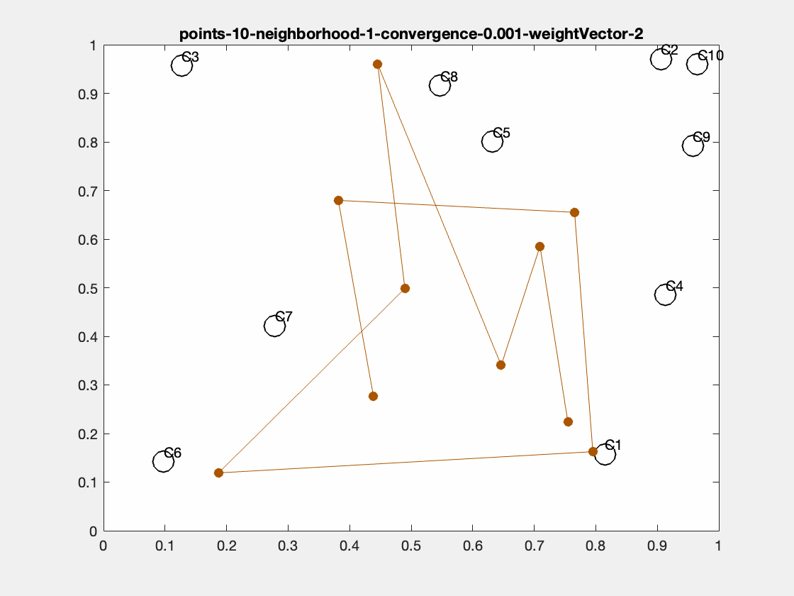
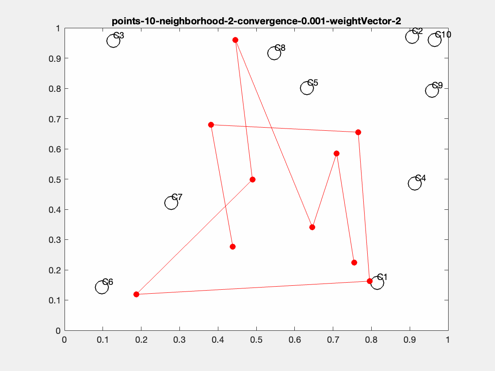

# Assignment 7 - Evolution of Weight Vectors

    

        
        </img>
        
        </img>
    

    

        
        </img>
        
        </img>
    

    

        
        </img>
        
        </img>
    

    

        
        </img>
        
        </img>
    

